## Proves:

### Intent amb isbn duplicat:
  
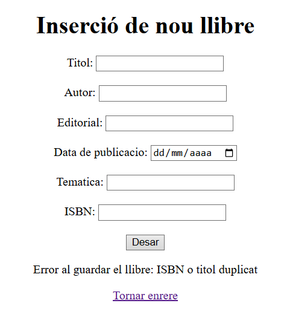

### Intent amb dades correctes:
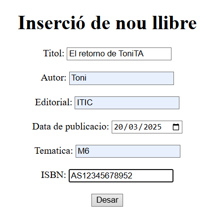  
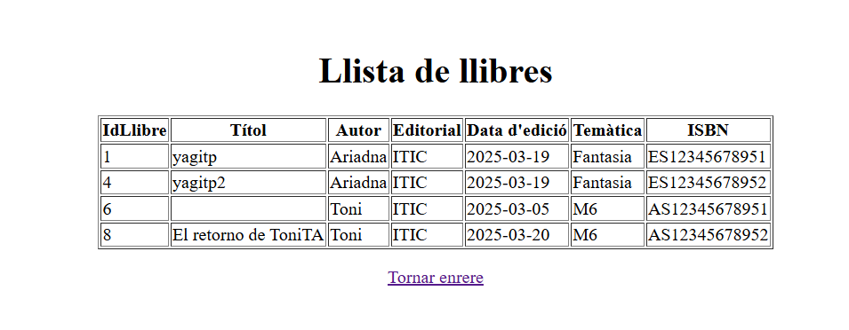  
(A la taula hi ha un registre sense títol, però ja està solucionat)

### Intent d'inserir un llibre sense títol:
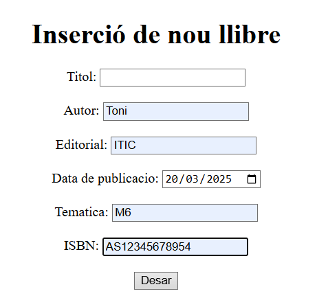  
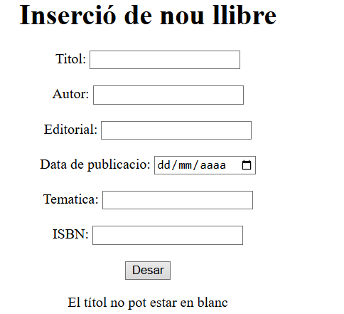

### Intent d'inserir un llibre sense data:
  
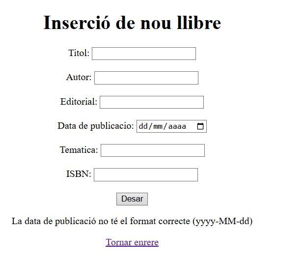

### Intent d'inserir un llibre amb títol repetit:
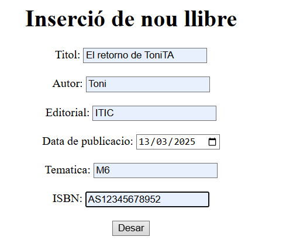  

### Intent d'inserir un llibre amb ISBN incorrecte:
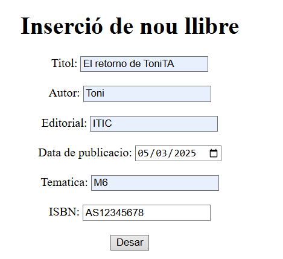  
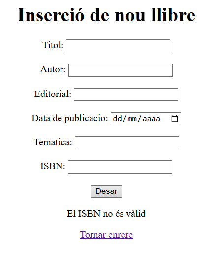

### Llista general de llibres:
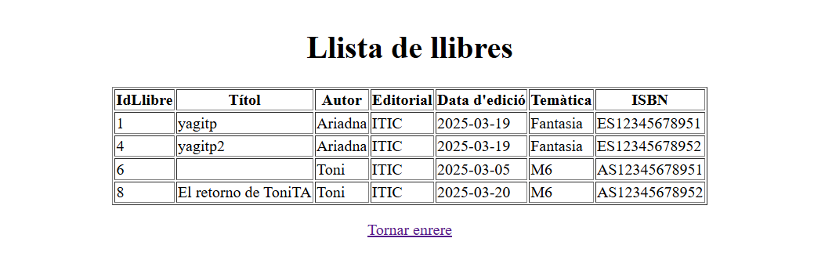

### Cerca llibre per id existent:
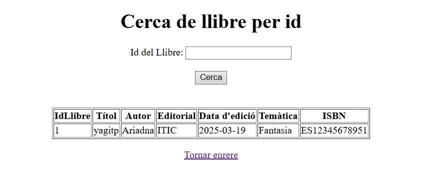

### Cerca llibre per id inexistent:
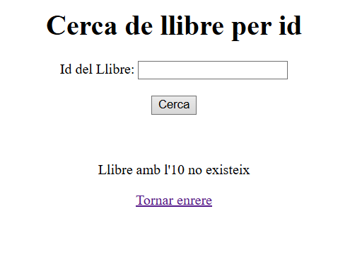

### Cerca de llibre per títol existent:
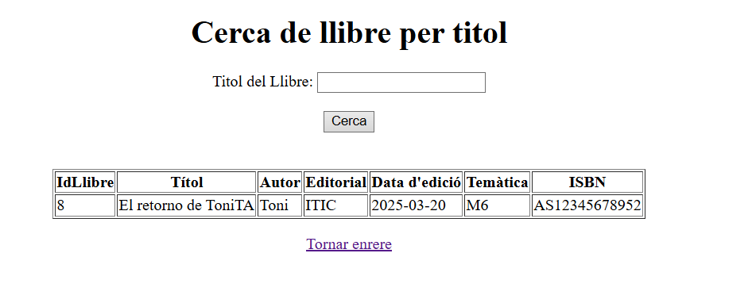

### Cerca de llibre per títol inexistent:
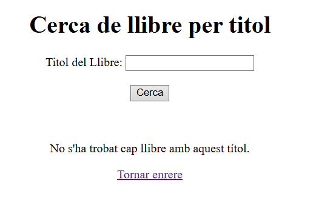

### Cerca de llibre per títol i editorial existent:
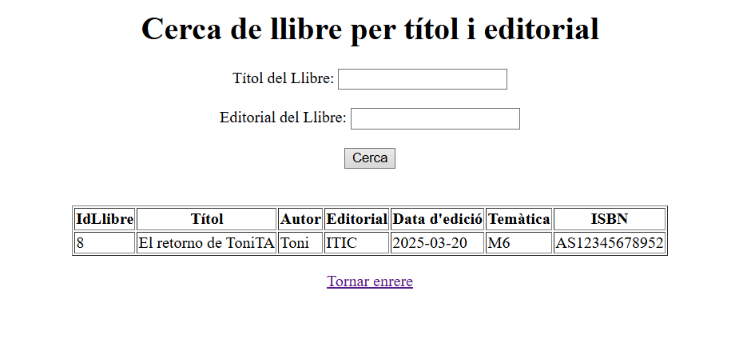

### Cerca de llibre per títol i editorial inexistent:
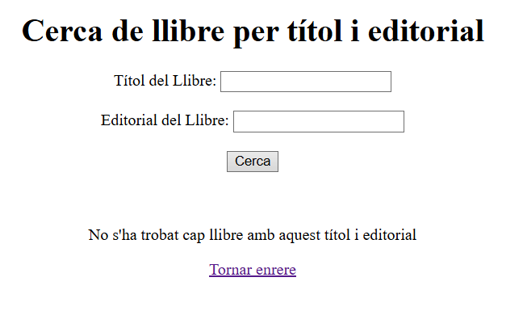

## Preguntes:

### Per què al servei estem utilitzant mètodes que no hem declarat explícitament al repositori? Com és possible?
Perquè els mètodes que no hem declarat explícitament al repositori venen proporcionats per `CrudRepository` sense necessitat de declarar-los. A més, crea consultes automàtiques per als nostres mètodes personalitzats com `findByTitol()` basant-se en el nom del mètode.

### El repositori pot elegir fer l’extends de les interfícies `PagingAndSortingRepository` o de `JpaRepository`. En què es diferencien aquestes dues amb la interfície `CrudRepository`?
`CrudRepository` fa les operacions bàsiques CRUD, mentre que la interfície `PagingAndSortingRepository` afegeix mètodes per ordenar de manera paginada i ordenada les operacions CRUD. La interfície `JpaRepository` estèn `PagingAndSortingRepository`, per tant té els mateixos mètodes, però afegeix mètodes com `flush()` (aquest serveix per forçar la sincronització amb la base de dades, per exemple, si s'ha modificat algun objecte, aquest mètode farà que els canvis es reflecteixin a la base de dades abans d'un commit o abans que la transacció finalitzi). Per tant, com en el nostre cas només volem fer les consultes bàsiques amb `CrudRepository`, estem bé.

### Què significa `Optional<Classe>` i per a què serveix?
És una classe que s'utilitza per indicar que un valor pot estar-hi o no. Així no cal que gestionem comprovant si l'objecte està buit o no, ho podem gestionar amb mètodes com `ifPresent()`.

### Per què el controlador utilitza el servei i no la seva implementació?
Crec que es per mantenir el codi més net, més facil de mantenir i més flexible, ja que ens permet canviar l'implementacio del servei sense haver de tocar el controlador ja que d'aquesta manera s'injecta el service quan sigui necessari

## Usuari
CREATE USER 'llibreGestio'@'localhost' IDENTIFIED BY 'system1234';
GRANT ALL PRIVILEGES ON `llibres`.* TO 'llibreGestio'@'localhost';
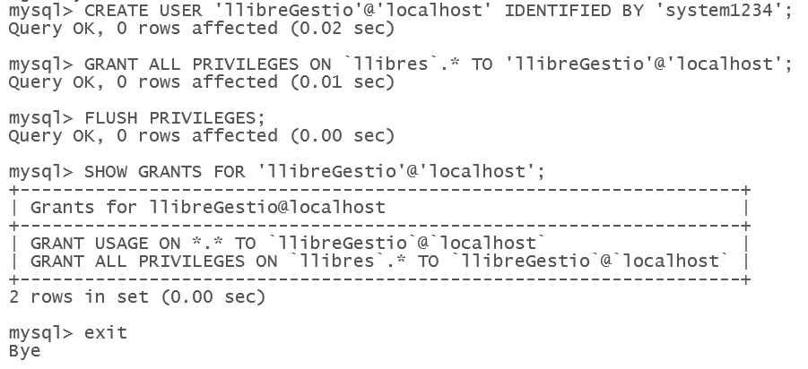