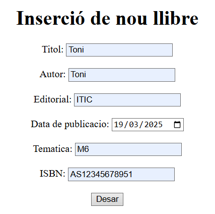
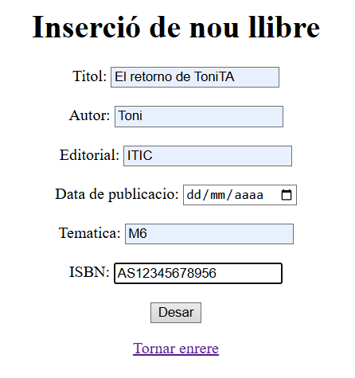

Creacio del registre del llibre:
Intent amb isbn duplicat:

Intent amb dades correctes:

(A la taula hi ha un registre sense titol, pero ja esta solucionat)
Intent d'inserir un llibre sense titol:

Intent d'inserir un llibre sense data:

Intent d'inserir un llibre amb titol repetit:

Intent d'inserir un llibre amb ISBN incorrecte:

Llista general de llibres:

Cerca llibre per id existent:

Cerca llibre per id inexistent:

Cerca de llibre per titol existent:

Cerca de llibre per titol inexistent:

Preguntes:
Per què al servei estem utilitzant mètodes que no hem declarat explícitament al repositori? Com és possible?
Perque els mètodes que no hem declarat explícitament al repositori venen
proporcionats per CrudRepository sense necessitat de declarar-los,
segons he buscat també crea consultes automatiques per els nostres metodes personalitzats com
find

El repositori pot elegir fer l’extends de les interfícies PagingAndSortingRepository o de JpaRepository. En què es 
diferencien aquestes dues amb la interfície CrudRepository?

Què significa Optional<Classe> i per a què serveix?
és una classe que s'utilitza per indicar que un valor pot estar-hi o no.
Aixì no cal que gestionem comprobant si l'objecte esta buid o no, ho podem
gestionar amb mètodes com ifPresent().

Per què el controlador utilitza el servei i no la seva implementació?

